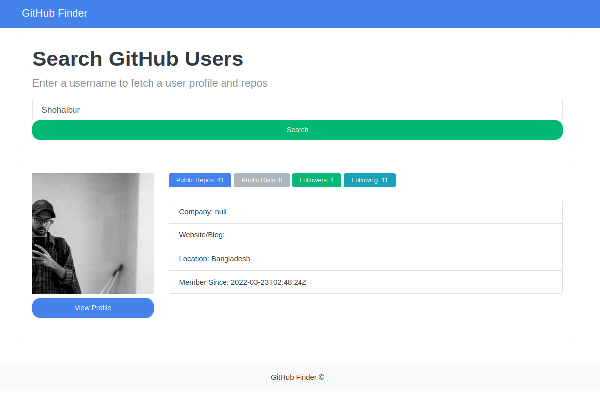
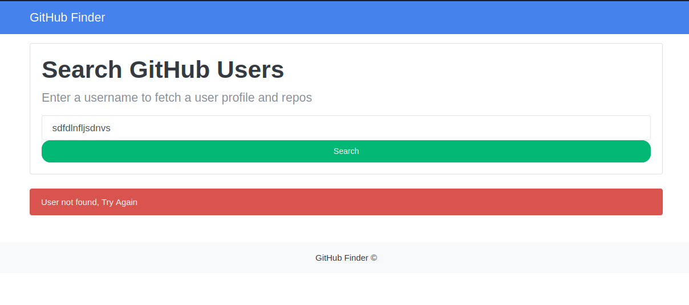

## Github Profile Finder 
`
This document provides an overview of Github Profile Finder, detailing the features for searching github Profiles using API with one click.
`

### Screenshots

<ol>
  <li>Home Page  
    
  </li>
  <li>Searched profile using Github username   
    
  </li>
  <li>
    Invalid or empty search will result in invalid notification which shows for 3 second and dissapear  
    
  </li>
</ol>

Thank you.
